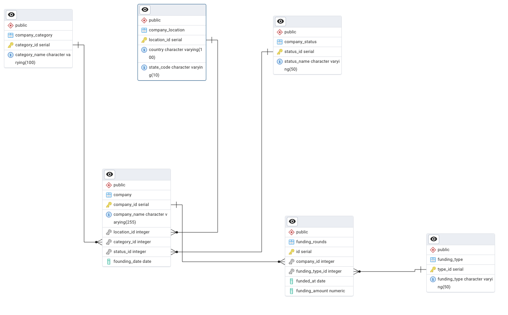

# Relational Database Design: Crunchbase Data Model

This project provides a relational database design for modeling Crunchbase-style data (2013)



## Project Structure
```
├── scripts/                # Bash scripts to execute psql commands (init, test, load)
├── sql_scripts/           # SQL scripts for schema creation and ETL
│   ├── schema/            # Schema definitions for staging, test, and final tables
│   └── *.sql              # SQL queries to populate data, run tests ...
├── raw_data/              # Input CSV files (e.g., Crunchbase datasets)
├── ER_diagram.png         # Entity-Relationship diagram of the database
└── README.md              # Project overview and usage instructions
```


## Testing
Tests are run via `scripts/test_schema.sh` to check:
- Unique constraints
- Check constraints
- Foreign key constraints

Error handling  is done via blocks


## How to Run
This project uses the psql client to connect to a locally installed PostgreSQL server.
If you're running PostgreSQL via Docker, please update the connection commands in the .sh scripts (e.g., docker run <postgres container>  -U ... -h ...) to match your container setup before executing any of the commands below.

0. Go to the current directory of the project

1. connect to the database, create database if not exists

```bash scripts/init_db.sh <username> <hostname> <databasename>```

2. to test the schema:

```bash scripts/test_schema.sh <username> <hostname> <databasename>```

<!-- 3. load content of input  data files to staging tables

```bash scripts/load_staging.sh <username> <hostname> <databasename>``` -->

3. create table from schema files, populate data from staging schema and drop the staging schema

```bash scripts/populate_tables.sh <username> <hostname> <databasename>```
