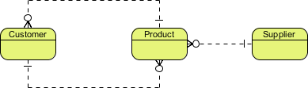
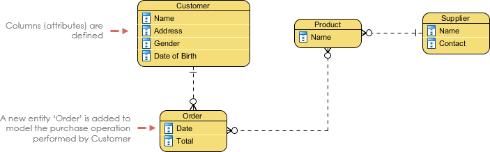
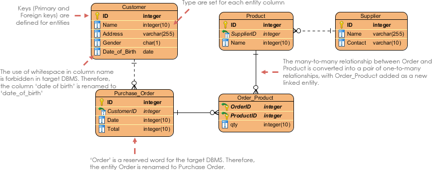

SQL best practices:\
https://www.databasestar.com/sql-best-practices/

`ERD` : entity relationship diagram
An entity relationship diagram (sometimes called an ER Diagram or ERD) is a visual representation of tabular data structures that are linked as part of a database. \
An ER model is typically drawn at up to three levels of abstraction:

- Conceptual ERD / Conceptual data model:Conceptual ERD models the business objects that should exist in a system and the relationships between them. 

- Logical ERD / Logical data model: detailed version of a Conceptual ERD.

- Physical ERD / Physical data model: presents the actual design blueprint of a relational databasephy

`entity`:
An entity is a "thing" or "object" in the real world that has an independent existence and can be distinctly identified (e.g., a person, place, or thing). \
Example: Student, Course, Book. \
A **strong entity** can be defined solely by its own attributes, can uniquely identify each instance of the entity.It has a primary key that ensures its uniqueness and is represented by a rectangle in an ER diagram.\
A **weak entity**  cannot be uniquely identified by its own attributes alone. A weak entity is associated with an identifying entity (strong entity), which helps in its identification. A weak entity are represented by a double rectangle.\
ex:A company may store the information of dependents (Parents, Children, Spouse) of an Employee. But the dependents can't exist without the employee. 

Entities are represented as rectangles in an ER diagram.

`Attribute`  properties that define the entity type. For example, for a Student entity Roll_No, Name, DOB, Age, Address, and Mobile_No are the attributes that define entity type Student. In ER diagram, the attribute is represented by an oval.
**Key attribute** uniquely identifies each entity in the entity set is called the key attribute. For example, Roll_No will be unique for each student.\
**Composite Attribute**: An attribute composed of many other attributes
Ex: Address attribute of the student Entity type consists of Street, City, State, and Country \
**Multivalued Attribute**attribute consisting of more than one value for a given entity. For example, Phone_No (can be more than one for a given student). In ER diagram, a multivalued attribute is represented by a double oval. 
**Derived Attribute** attribute that can be derived from other attributes of the entity type is known as a derived attribute. e.g.; Age (can be derived from DOB). In ER diagram, the derived attribute is represented by a dashed oval.

`Relatiohship`: describes how entities are associated with one another.Relationships are represented as diamonds in an ER diagram, connecting related entities. \
Degree of a Relationship set:
1. Unary Relationship:  ONE entity set participating in a relation, the relationship is called a unary relationship. For example, one person is married to only one person.
2. Binary Relationship: When there are TWO entities set participating in a relationship, the relationship is called a binary relationship. For example, a Student is enrolled in a Course.
3. Ternary Relationship: When there are three entity sets participating in a relationship, the relationship is called a ternary relationship.
4. N-ary Relatiohship: When there are n entities set participating in a relationship, the relationship is called an n-ary relationship.

Cardinality in ER Model:
- One-to-One (1:1): One entity instance is related to exactly one instance of another entity (e.g., one Person has one Passport).
- One-to-Many (1:N): One entity instance is related to multiple instances of another entity (e.g., one Teacher teaches many Students).
- Many-to-Many (M:N): Multiple instances of one entity are related to multiple instances of another (e.g., Students enroll in multiple Courses, and each Course has multiple Students).

Keys
1. Primary Key:  primary key is one or more columns in a table that are used to uniquely identify the row. \
data in the columns must be unique. If there is a second record that is added with the same values for the primary key as an existing record, the new record won't be inserted. You'll get an error saying the primary key says a record already exists. Also, the columns in the primary key cannot contain NULL values. You must specify a value.

2. natural key: natural key is an attribute that exists in the real world or is used by the business. It can be used to uniquely identify the row.

3. Surrogate Key (**recommended**):  word surrogate means substitute. A surrogate key is an attribute that is invented or made up for the sole purpose of being used as the primary key. It has no value to the business or the real world.Surrogate keys are often used when there is no other way to identify a record - when there is no natural key. They are often an integer value, starting at 1 and incrementing for each new record.

4. Composite Key: composite key is a primary key, or unique identifier, that is made up or more than one attribute.

5. Alternate Key:  any of the candidate keys that are not the primary key.

6. Unique Key: A unique key is an attribute in the table which is unique. It can be used to identify a row, but may not be the primary key. This can also be called an alternate key.

7. Foreign Key: A foreign key is a column or set of columns in a table that refers to a primary key in another table.

